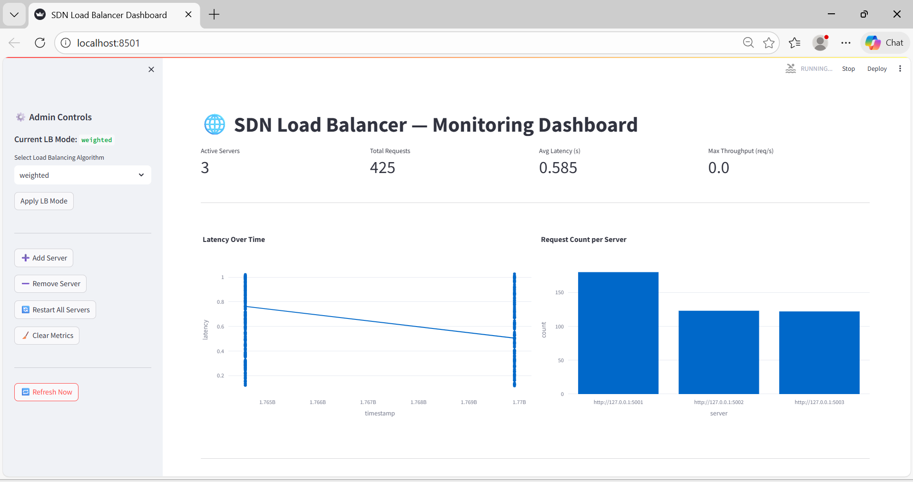
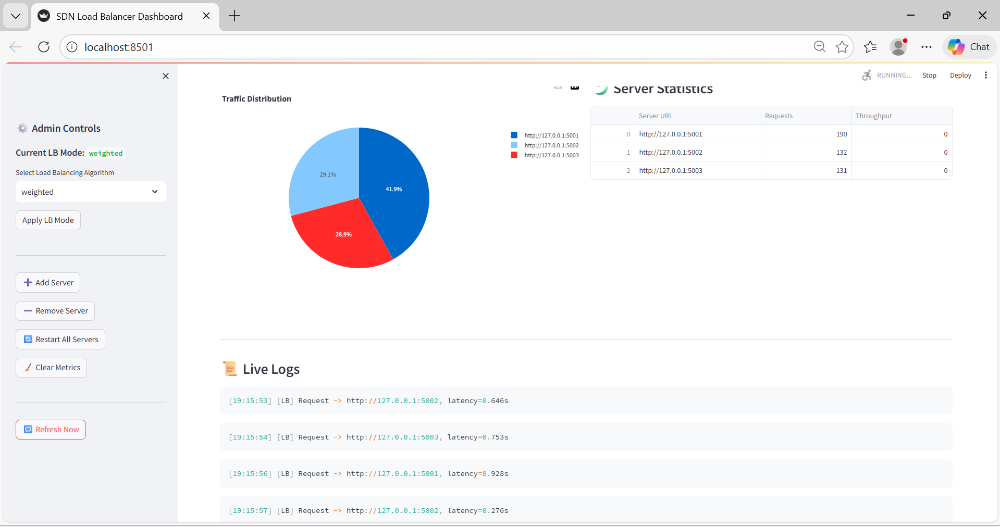

# SDN Load Balancer with Predictive Autoscaling and Dashboard

This project implements a Software Defined Networking (SDN) inspired load balancing system using Python. It demonstrates centralized control of multiple backend servers with real-time monitoring, predictive autoscaling, health management, and an interactive Streamlit dashboard. The system separates the Data Plane, Control Plane, and Management Plane to simulate real-world SDN architecture.

---

## 🚀 Features

- Multiple backend Flask servers  
- Centralized load balancer (Weighted, Round Robin, Random, Least Connection)  
- Heartbeat-based health monitoring  
- Automatic server recovery (simulated)  
- Predictive autoscaling using latency trends  
- CPU-aware weighted routing  
- Real-time metrics collection  
- Streamlit dashboard for visualization and admin control  
- Live logs and performance statistics  

---

## 📸 Dashboard Screenshots

### Monitoring Dashboard Overview



### Traffic Distribution and Live Logs



---


## ⚙️ Requirements

- Python 3.11 (64-bit)
- Windows / Linux / macOS

---

## ▶️ Execution Steps

1. Navigate to project root:

```bash
cd Project SDN
Install dependencies:

py -3.11 -m pip install -r requirements.txt
Start backend servers (in separate terminals):

py -3.11 servers/server1.py
py -3.11 servers/server2.py
py -3.11 servers/server3.py
Start load balancer services:

cd load_balancer
py -3.11 heartbeat.py
py -3.11 autoscale.py
py -3.11 balancer.py
Launch dashboard:

cd dashboard
py -3.11 -m streamlit run dashboard.py
Generate client traffic:

cd clients
py -3.11 traffic_test.py
Dashboard URL:

http://localhost:8501
Load Balancer URL:

http://127.0.0.1:8000
